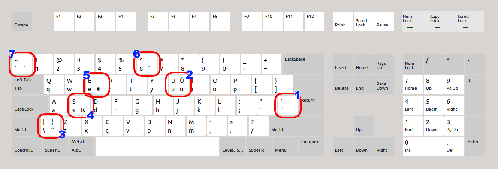

# The ‘Multilingual (Měchura)’ keyboard layout

This is the one and only keyboard layout I use *both* for coding *and* for typing text in the four languages I usually type text in (English, Irish, Czech, German), all without having to switch keyboard layouts. Switching keyboard layouts drives me mad! I don't want to be mad, so I made myself this.

The layout is as close as possible to the **English (US)** layout, which is exactly what I need for writing computer code, and of course for typing English. Then:

- **Key 1** acts as a dead key. When pressed on its own it gives me the *combining acute accent* for typing `áéí` and so on in Irish and Czech. When pressed with <kbd>Shift</kbd> it gives a *combining caron* for typing `řšň` and so on in Czech.

- **Key 2** when pressed with **AltGr** gives me `ů` (= `u` with ring above) for Czech. And when I add <kbd>Shift</kbd> it gives me the capitalized version of that, `Ů`.

With those two keys we have Irish and Czech covered. Let's see about German now.

- **Key 3** when pressed with <kbd>AltGr</kbd> acts as a dead key and gives me the *combining diaeresis* (aka *Umlaut*) for typing `äöü` in German.

- **Key 4**, the <kbd>S</kbd> key, when pressed with <kbd>AltGr</kbd>, gives me the lower-case German *Eszett* `ß`.

With that we have German covered. Let's see what else there is.

- **Key 5** (the <kbd>E</kbd> key) when pressed with <kbd>AltGr</kbd> gives me the Euro sign `€`.

- **Key 6** (the <kbd>6</kbd> key) when pressed with <kbd>AltGr</kbd> acts as a dead key and gives me the *combining circumflex*. I need it occasionally for typing fancy Frenchie words like *Côtes du Rhône*. Yes, wine names mostly.

- **Key 7** is our last key and another Frenchie enabler. When pressed with <kbd>AltGr</kbd> it acts as a dead key and gives me the *combining grave accent*. Great for saying that something is *à la* something else, and also for the occasional excursion into Scottish Gaelic (*tha mi sgìth*).

Finally, I've added a few features to this keyboard layout to satisfy my very fine tastes in typography (**Achtung:** these only work in the Linux version, not in the Windows version):

- <kbd>AltGr</kbd> + <kbd>A</kbd> gives `“` (a 66-shaped opening double quote).
- <kbd>AltGr</kbd> + <kbd>D</kbd> gives `”` (a 99-shaped closing double quote).
- <kbd>AltGr</kbd> + <kbd>Z</kbd> gives `‘` (a 6-shaped opening single quote).
- <kbd>AltGr</kbd> + <kbd>X</kbd> gives `’` (a 9-shaped closing single quote).
- <kbd>AltGr</kbd> + <kbd>-</kbd> gives `–` (en-dash).
- <kbd>AltGr</kbd> + <kbd>+</kbd> gives `×` (multiplication).
- <kbd>AltGr</kbd> + <kbd>></kbd> gives `→` (rightwards arrow).

## Installing it

There is a version for Linux and a version for Windows here.

The Linux version is in the `Linux` directory (I bet you didn't expect that). To install it, you basically need to copy and edit a few files and then restart. You'll find some rudimentary instructions in `readme.txt` there. It works for me on my installation of Ubuntu but that's all I know. I learned how to do it from [here](https://askubuntu.com/questions/482678/how-to-add-a-new-keyboard-layout-custom-keyboard-layout-definition).

The Windows version (which is in the `Windows` directory, shocking!) was made with [Microsoft Keyboard Layout Creator](https://www.microsoft.com/en-us/download/details.aspx?id=102134). If you want you can install Microsoft Keyboard Layout Creator and open the file `mx.klc` to edit the layout. If you just want to install it, go to the `Built` directory there and run `setup.exe`.

On both Linux and Windows, the layout will appear in your list of available keyboard layouts as **Multilingual (Měchura)**. On Linux it is connected to all the four languages, so when you go in to add a keyboard layout, you should pick either English or Irish or Czech or German and the layout should be offered to to you. On Windows, Microsoft Keyboard Layout Creator doesn't allow a keyboard layout to be connected to more than one language, so I have connected it to Irish.

That is all. Enjoy.
